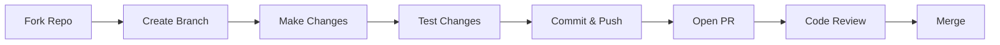

<div align="center">

> **DISCLAIMER: THIS PROJECT IS INCOMPLETE AND UNDER DEVELOPMENT**

# 🏦 NextBank - Modern Banking Application


*A comprehensive banking application built with Next.js 14*

[](https://nextjs.org/)
[](https://typescriptlang.org/)
[](https://tailwindcss.com/)
[](https://appwrite.io/)
[](https://plaid.com/)

[📖 Documentation](./docs) • [🐛 Report Bug](https://github.com/yourusername/nextbank/issues)

</div>

---

---

## 🎯 What is NextBank?

NextBank is a **modern, secure, and user-friendly** banking application that brings all your financial accounts together in one place. Built with cutting-edge technologies, it offers seamless account management, instant transfers, and comprehensive transaction tracking.

## ✨ Key Features

<table>
<tr>
<td width="50%">

### 🔐 **Secure Authentication**
- Multi-factor authentication
- Secure session management
- Password encryption

### 🏦 **Bank Integration**
- Connect 11,000+ financial institutions
- Real-time account syncing
- Automatic transaction categorization

### 📊 **Financial Dashboard**
- Real-time balance updates
- Interactive charts and graphs
- Spending analytics

</td>
<td width="50%">

### 💸 **Instant Transfers**
- Bank-to-bank transfers
- Peer-to-peer payments
- Transfer scheduling

### 📱 **Mobile-First Design**
- Responsive across all devices
- Touch-friendly interface
- Offline capability

### 🔍 **Transaction Management**
- Detailed transaction history
- Search and filtering
- Export capabilities

</td>
</tr>
</table>

<div align="center">

</div>

## 🏗️ Tech Stack

<div align="center">

### Frontend


### Backend & Database


### APIs & Services


### UI & Visualization


</div>

<details>
<summary><b>📋 Complete Dependencies List</b></summary>

| Category | Technology | Purpose |
|----------|------------|---------|
| **Framework** | Next.js 14 | React framework with App Router |
| **Language** | TypeScript | Type-safe JavaScript |
| **Styling** | Tailwind CSS | Utility-first CSS framework |
| **UI Components** | Radix UI | Accessible component primitives |
| **Forms** | React Hook Form + Zod | Form handling and validation |
| **Database** | Appwrite | Backend-as-a-Service |
| **Banking API** | Plaid | Financial institution connectivity |
| **Charts** | Chart.js | Data visualization |
| **Fonts** | Geist | Modern font family |
| **Monitoring** | Sentry | Error tracking and performance |

</details>

## 📁 Project Architecture

<div align="center">

```
┌─────────────────────────────────────────────────────────────┐
│                        NextBank App                         │
├─────────────────────────────────────────────────────────────┤
│  ┌─────────────┐  ┌─────────────┐  ┌─────────────┐       │
│  │     UI      │  │   Logic     │  │  External   │       │
│  │ Components  │◄─┤  Actions    │◄─┤   APIs      │       │
│  │             │  │             │  │             │       │
│  │ • AuthForm  │  │ • Bank      │  │ • Plaid     │       │
│  │ • Dashboard │  │ • User      │  │ • Dwolla    │       │
│  │ • Charts    │  │ • Transfer  │  │ • Appwrite  │       │
│  └─────────────┘  └─────────────┘  └─────────────┘       │
└─────────────────────────────────────────────────────────────┘
```

</div>

### 🗂️ Folder Structure

```
nextbank/
├── 📱 app/                    # Next.js App Router
│   ├── 🔐 (auth)/            # Authentication routes
│   │   ├── sign-in/          # Login page
│   │   └── sign-up/          # Registration page
│   ├── 🏠 (root)/            # Protected application routes
│   │   ├── page.tsx          # Dashboard homepage
│   │   ├── my-banks/         # Bank accounts management
│   │   ├── payment-transfer/ # Money transfer interface
│   │   └── transaction-history/ # Transaction logs
│   └── 🔌 api/               # API endpoints
├── 🧩 components/            # Reusable UI components
│   ├── 🎨 ui/               # Base design system components
│   ├── AuthForm.tsx         # 🔐 Authentication form
│   ├── BankCard.tsx         # 💳 Bank account display
│   ├── PlaidLink.tsx        # 🏦 Bank connection widget
│   └── ...                  # Other specialized components
├── 📚 lib/                  # Core utilities and configurations
│   ├── ⚡ actions/          # Server-side business logic
│   ├── appwrite.ts          # 🗄️ Database configuration
│   ├── plaid.ts             # 🏦 Banking API setup
│   └── utils.ts             # 🛠️ Helper functions
├── 📋 constants/            # Application-wide constants
└── 🎯 public/              # Static assets and images
```

<div align="center">

<p><i>High-level application architecture</i></p>
</div>

## 🚀 Quick Start Guide

<div align="center">

</div>

### 📋 Prerequisites

<table>
<tr>
<td align="center" width="25%">
<br/>
<b>Node.js 18+</b>
</td>
<td align="center" width="25%">
<br/>
<b>Appwrite Account</b>
</td>
<td align="center" width="25%">
<br/>
<b>Plaid Developer</b>
</td>
<td align="center" width="25%">
<br/>
<b>Git</b>
</td>
</tr>
</table>

### ⚡ Installation Steps

<details>
<summary><b>Step 1: Clone Repository</b></summary>

```bash
# Clone the repository
git clone https://github.com/yourusername/nextbank.git

# Navigate to project directory
cd nextbank
```

</details>

<details>
<summary><b>Step 2: Install Dependencies</b></summary>

```bash
# Using npm
npm install

# Using yarn
yarn install

# Using pnpm (recommended)
pnpm install
```

</details>

<details>
<summary><b>Step 3: Environment Configuration</b></summary>

Create a `.env.local` file in the root directory:

```env
# 🗄️ Appwrite Configuration
NEXT_PUBLIC_APPWRITE_ENDPOINT=https://cloud.appwrite.io/v1
NEXT_PUBLIC_APPWRITE_PROJECT=your_project_id
APPWRITE_DATABASE_ID=your_database_id
APPWRITE_USER_COLLECTION_ID=users
APPWRITE_BANK_COLLECTION_ID=banks
APPWRITE_TRANSACTION_COLLECTION_ID=transactions
NEXT_APPWRITE_KEY=your_appwrite_secret_key

# 🏦 Plaid Configuration
PLAID_CLIENT_ID=your_plaid_client_id
PLAID_SECRET=your_plaid_secret
PLAID_ENV=sandbox

# 💸 Dwolla Configuration
DWOLLA_KEY=your_dwolla_key
DWOLLA_SECRET=your_dwolla_secret
DWOLLA_BASE_URL=https://api-sandbox.dwolla.com

# 🔍 Sentry Configuration (Optional)
SENTRY_DSN=your_sentry_dsn
```

<div align="center">

</div>

</details>

<details>
<summary><b>Step 4: Run Development Server</b></summary>

```bash
# Start the development server
npm run dev

# Or with other package managers
yarn dev
pnpm dev
```

🎉 **Success!** Open [http://localhost:3000](http://localhost:3000) in your browser.

</details>

### 🎮 Available Scripts

| Command | Description | Usage |
|---------|-------------|-------|
| `dev` | 🚀 Start development server | `npm run dev` |
| `build` | 🏗️ Build for production | `npm run build` |
| `start` | ▶️ Start production server | `npm run start` |
| `lint` | 🔍 Run ESLint | `npm run lint` |

## 🧩 Component Architecture

<div align="center">

</div>

### 🔐 Authentication Components

<table>
<tr>
<td width="50%">

**AuthForm Component**
```typescript
<AuthForm 
  type="sign-in" // or "sign-up"
  onSuccess={(user) => redirect('/dashboard')}
/>
```

</td>
<td width="50%">

</td>
</tr>
</table>

### 🏦 Banking Components

<table>
<tr>
<td width="50%">

</td>
<td width="50%">

**BankCard Component**
```typescript
<BankCard 
  account={bankAccount}
  showBalance={true}
  type="full" // or "credit"
/>
```

</td>
</tr>
</table>

### 📊 Financial Visualization

<div align="center">

| Component | Purpose | Preview |
|-----------|---------|---------|
| **TotalBalanceBox** | Account balance overview |  |
| **DoughnutChart** | Balance distribution |  |
| **TransactionsTable** | Transaction history |  |

</div>

### 📱 Navigation Components

<div align="center">

```
┌─────────────────────────────────────────────────────────┐
│  Sidebar (Desktop)           │    MobileNav (Mobile)    │
├─────────────────────────────────────────────────────────┤
│  • Dashboard                 │    ☰ Hamburger Menu      │
│  • My Banks                  │    • Dashboard            │
│  • Transfer Funds            │    • My Banks             │
│  • Transaction History       │    • Transfer Funds       │
│  • Settings                  │    • Transaction History  │
└─────────────────────────────────────────────────────────┘
```

</div>

## 🔒 Security & Privacy

<div align="center">

</div>

<table>
<tr>
<td width="50%">

### 🛡️ **Security Measures**
- ✅ End-to-end encryption
- ✅ Secure session management
- ✅ HTTPS enforcement
- ✅ CSRF protection
- ✅ XSS prevention
- ✅ Input validation with Zod

</td>
<td width="50%">

### 🔐 **Data Protection**
- ✅ Environment variable protection
- ✅ API key encryption
- ✅ Database access control
- ✅ Protected API endpoints
- ✅ Real-time error monitoring
- ✅ Audit logging

</td>
</tr>
</table>

### 🏦 Banking Security Standards

<div align="center">

| Standard | Description | Status |
|----------|-------------|--------|
| **PCI DSS** | Payment Card Industry compliance | ✅ Compliant |
| **SOC 2** | Security and availability standards | ✅ Compliant |
| **256-bit SSL** | Data encryption in transit | ✅ Enabled |
| **OAuth 2.0** | Secure authentication protocol | ✅ Implemented |

</div>

## 📱 Responsive Design

<div align="center">

### 🖥️ Desktop Experience


### 📱 Mobile Experience  


### 📊 Breakpoint System

| Device | Breakpoint | Layout |
|--------|------------|---------|
| 📱 **Mobile** | < 640px | Single column, bottom navigation |
| 📱 **Tablet** | 640px - 1024px | Adaptive sidebar, touch-optimized |
| 🖥️ **Desktop** | > 1024px | Full sidebar, multi-column layout |

</div>

### 🎨 Design System

<table>
<tr>
<td width="33%">

**🎨 Colors**
- Primary: `#2563eb`
- Secondary: `#64748b`  
- Success: `#10b981`
- Warning: `#f59e0b`
- Error: `#ef4444`

</td>
<td width="33%">

**📝 Typography**
- Font Family: `Geist`
- Headings: `Geist`
- Body: `Geist`
- Code: `Geist Mono`

</td>
<td width="33%">

**📏 Spacing**
- Base unit: `4px`
- Small: `8px`
- Medium: `16px`
- Large: `24px`
- XL: `32px`

</td>
</tr>
</table>


### 🎯 Ways to Contribute

<table>
<tr>
<td width="25%" align="center">
<br/>
**🐛 Bug Reports**<br/>
Found a bug? Let us know!
</td>
<td width="25%" align="center">
<br/>
**✨ Feature Requests**<br/>
Have an idea? Share it!
</td>
<td width="25%" align="center">
<br/>
**💻 Code Contributions**<br/>
Submit pull requests
</td>
<td width="25%" align="center">
<br/>
**📚 Documentation**<br/>
Improve our docs
</td>
</tr>
</table>

### 🔄 Development Workflow



<details>
<summary><b>📋 Step-by-Step Guide</b></summary>

1. **🍴 Fork the repository**
   ```bash
   # Fork on GitHub, then clone your fork
   git clone https://github.com/yourusername/nextbank.git
   ```

2. **🌿 Create a feature branch**
   ```bash
   git checkout -b feature/amazing-feature
   ```

3. **💻 Make your changes**
   - Follow our coding standards
   - Add tests for new features
   - Update documentation

4. **✅ Test your changes**
   ```bash
   npm run lint
   npm run build
   npm run test
   ```

5. **📤 Commit and push**
   ```bash
   git commit -m "✨ Add amazing feature"
   git push origin feature/amazing-feature
   ```

6. **🔄 Open a Pull Request**
   - Use our PR template
   - Describe your changes
   - Link related issues

</details>

### 📝 Code Standards

- **TypeScript**: Use strict typing
- **ESLint**: Follow configured rules
- **Prettier**: Format code consistently  
- **Conventional Commits**: Use semantic commit messages
- **Testing**: Add tests for new features

## 📚 Documentation & Resources

<div align="center">

### 🔗 Quick Links

[](./docs/api)
[](./docs/design)
[](./docs/testing)
[](./docs/deployment)

</div>

## 📄 License

This project is licensed under the **MIT License** - see the [LICENSE](LICENSE) file for details.

## ⚠️ Important Disclaimer

<div style="background: linear-gradient(135deg, #fef3cd, #f59e0b); padding: 20px; border-radius: 10px; margin: 20px 0;">

**🚨 Educational Purpose Only**

This is a **demo application** built for educational and portfolio purposes. 

**⚠️ NOT SUITABLE FOR PRODUCTION** without proper:
- Security auditing
- Compliance review (PCI DSS, SOC 2)
- Financial regulations compliance
- Professional security assessment

</div>

## 🙏 Acknowledgments

- **Plaid** for excellent banking API
- **Appwrite** for backend services
- **Vercel** for hosting platform
- **Next.js team** for the amazing framework
- **Open source community** for endless inspiration


---

<div align="center">

</div>

</div>
